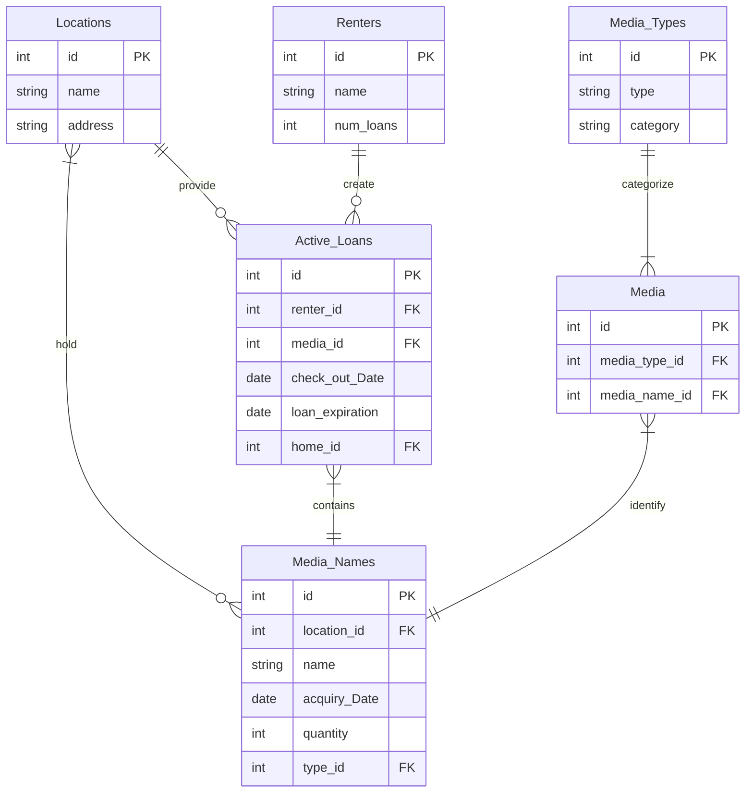

## PhysicalMediaLibrary
A database that manages a physical media rental system 

## What each table does
* Locations: Stores all the locations where the media is stored and loans managed
* Media_Types: Stores all the types of physical media available (Such as DVD, Vinyl, Cassette)
* Media_Names: Stores all the actual titles available (Movies, Music, etc)
* Media: The table that links Media_Types and Media_Names
* Renters: Stores the people who are currently renting media
* Active_Loans: Tracks every rental and links a renter to what media they currently have checked out, with checkout and expiration dates

#### USAGE
* Make sure you have the database with all the entries inputted and created
* Python3 the main.py file to begin utilizing the database
* Select options based on the list
##### When it asks you to select an entity from a list you have to use the ID number

#### Video Demonstration
https://github.com/Solemouse/PhysicalMediaLibrary/blob/main/2026-05-04%2023-35-48.mp4

#### ERD Diagram

### Reflection
As it turns out, getting things to work exactly as you want them to in Python with MySQL is rather difficult, and docker likes to be a pain.
