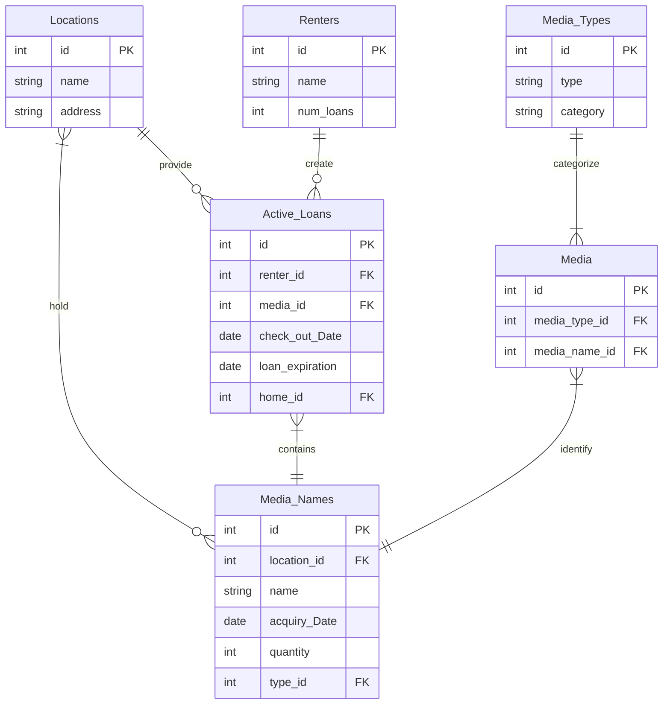

# PhysicalMediaLibrary
A database to organize physical media, where it is stored, and who is loaning it out

```mermaid
erDiagram
    Locations }|--o{ Media_Names : hold
    Locations ||--o{ Active_Loans : provide
    Active_Loans }| -- || Media_Names : contains
    Renters ||--o{ Active_Loans : create
    Media_Types ||--|{ Media : categorize
    Media }|--|| Media_Names : identify
    Locations {
        int id PK
        string name
        string address
    }
    Media_Types {
        int id PK
        string type
        string category
    }
    Renters {
        int id PK
        string name
        int num_loans
    }
    Active_Loans {
        int id PK
        int renter_id FK
        int media_id FK
        date check_out_Date
        date loan_expiration
        int home_id FK
    }
    Media_Names {
        int id PK
        int location_id FK
        string name
        date acquiry_Date
        int quantity
        int type_id FK
    }
    Media {
        int id PK
        int media_type_id FK
        int media_name_id FK
    }
```
