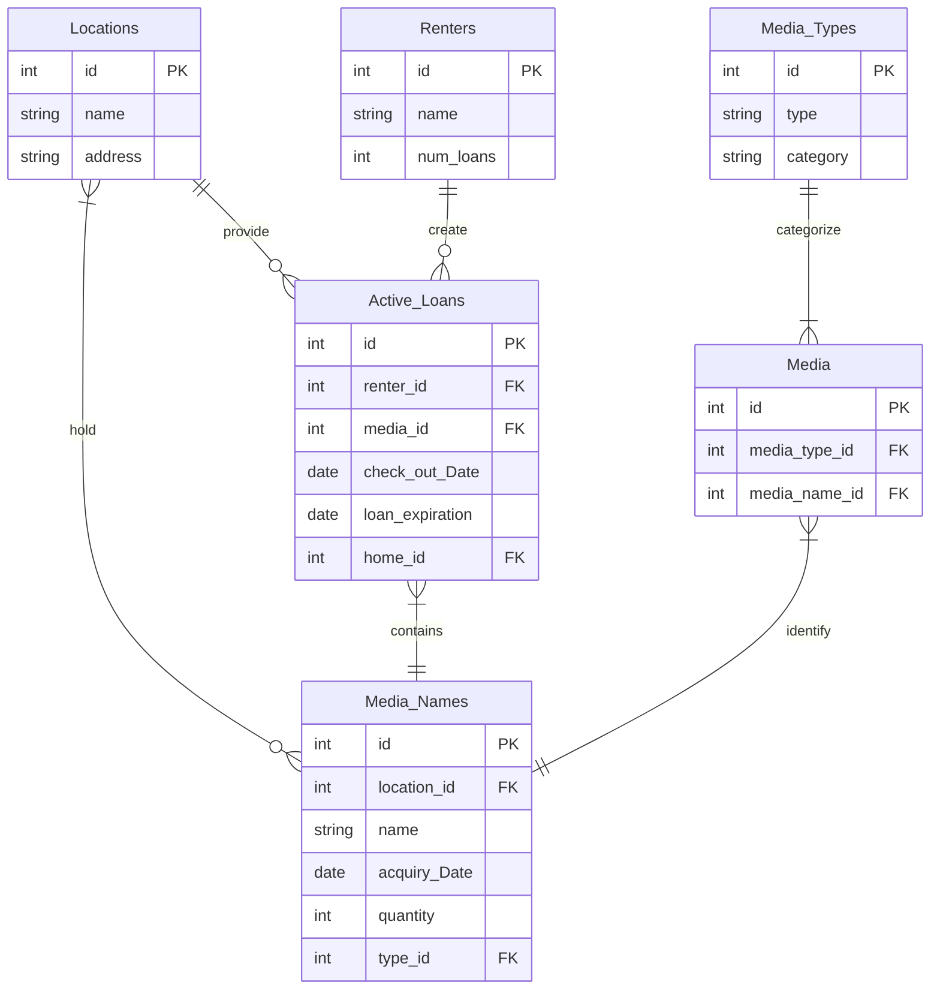

## PhysicalMediaLibrary
A database that manages a physical media rental system 

## What each table does
* Locations: Stores all the locations where the media is stored and loans managed
* Media_Types: Stores all the types of physical media available (Such as DVD, Vinyl, Cassette)
* Media_Names: Stores all the actual titles available (Movies, Music, etc)
* Media: The table that links Media_Types and Media_Names
* Renters: Stores the people who are currently renting media
* Active_Loans: Tracks every rental and links a renter to what media they currently have checked out, with checkout and expiration dates

#### USAGE

#### MORE STUFF
* First download the fishserver.py file and a client file of your chosing
* Find the ip of the server
* Launch the client of your chosing
* If using fishclient it will automatically ask for a port
* If using fishchatsharp you need to go to file and then connect to server
* Then you enter the ip, port, and username
* Then it will connect and you can start chatting

#### Video Demonstration

